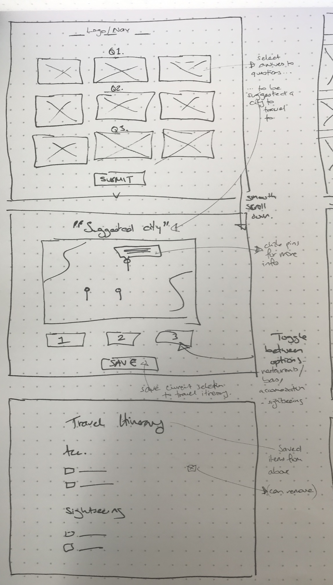
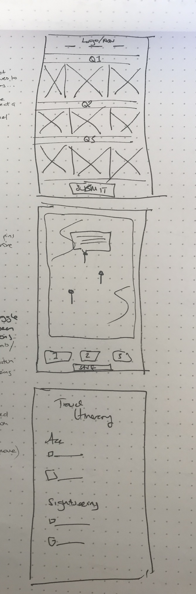
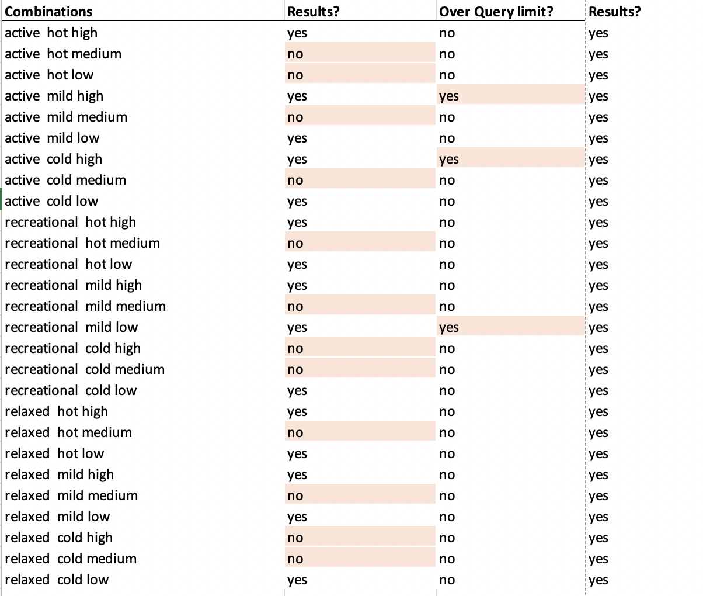
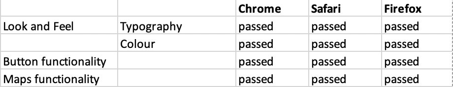
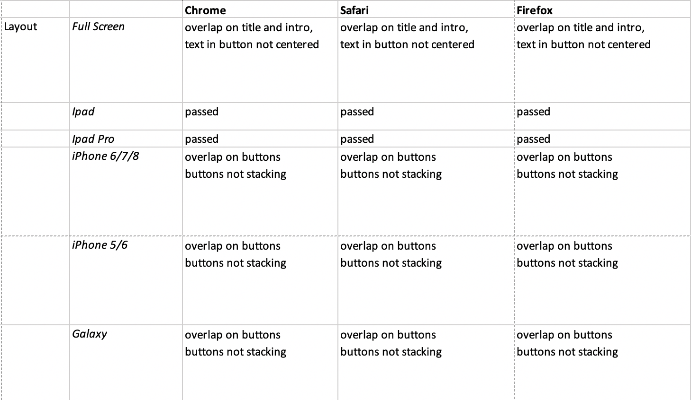

<h1>Vojaĝado</h1>

<h2>Final site address</h2>
https://sammydartnall10.github.io/travelapp/

<h2>About this page</h2>
<h3>Vojaĝado - an app to help inspire travel destination ideas</h3>

Vojaĝado translates to simply 'travel' in Esparanto, and is a simple, easy to use app that suggests new travel destinations based on raw data, facts and figures, rather then commercial promotion.
The Esparanto langauge itsef is an auxillary universal second languge created to foster peace and international understanding.  

This site calls on the Google Maps API, Places API, Google Geocoder API and Nearby Places search to allow users to search for their next holiday destination. The app helps users:
Select a destination city
Find tourist attractions
Find accommodation
Find bars and restaurants

It then provids search results in a manner that is visually appealing.

As a single page site the funcitonality of the app is revealed in stages - the user is prompted to make selections and then submit them. The user is taken to each new step of the process without need for their intervention.  

Bootstrap has been used to structure the page, and elements such as buttons and centering functionalty has been employed from the bootstrap library to give a consistent look and feel. 
This has then been styled using my own CSS to change font, colour and behaviour of some elements. 

<h2>UX</h2>
This site is aimed at people who are looking for new ideas and inspiration for their next trip. 
It is aimed at those who are looking to go somewhere perhaps a bit different to your ususal "top 10 places to go this summer". It is based,
therefore, on three objective data sets available on the web. 

After answering three simple questions, the site returns a range of city suggestions to the user, displayed on a Google maps. 
The user can then select a destination and look at the bars, restaurants, places to stay and things to see in the area. 

The look and feel of the site should be consistent across mobile, ipad, and desktop version. To acheive this a grid system is employed: 

The app was designed in a way so that the user can go back over their selections, and change them without having to refresh the whole page, or make
initial selections eg "active, hot, cheap" in that linear order. As the variables are set out as objects at the start of the app, 
selecting a differnt option updates the instance of that object, and doesnt require resetting. 

<h2>Features</h2>
The website has a number of deployed features, but also a few that may be implemented at a later date. 

<h3>Existing Features</h3>
 Categorisation of cities based on three factors 
* Cost of living 
* Average temperature 
* Development of tourism industry

Resources for each of these are as follows: 
* Cost of living (https://www.numbeo.com/cost-of-living/rankings_by_country.jsp?title=2018)
* Average temperature (https://en.wikipedia.org/wiki/List_of_countries_by_average_yearly_temperature)
* Development of tourism industry (http://www.adventureindex.travel/downloads.htm)

The site uses the Google Geocoder to find the latitude and longitutde of a city, passed through as a string. 
This makes the site easy to maintian, update and grow. As new data is available the city names and their corresponding 
values can be collated in a program such as excel, and converted to JSON data. 
In this way, values can be edited, and the database itself extended to add more destinations.

The end options displayed at the bottom of the app also have the option to be 'booked' - the book button will take 
the users current selection and pull the website on Google of that location, directing the user - in a new tab - the the website of the selected bar/restaurant etc. 

<h3>Features Left to Implement</h3>

To make the cost feature more useful, could add in the users location at the start of the site, and add in
distance from current location factor to calculate the cost of getting to that city.

A more robust method of taking the top 10 cities - see "oever quota limit" error documented in 'testing' section below. 

A itineray builder could form an intermediary step in between reviewing bars etc and clicking book. Users 
could 'add' selections to a list, possibly just below the buttons. 
The booking button could then be linked with tripadvisor/booking.com/kayak to take users to a one-stop booking site. 
Alternatively they could book with the site direct, as many people still do prefer to book direct. 

<h2>Technologies Used</h2>

HTML5 has been used to provide the basic structre to the site.

For site styling and stucture, the Bootstrap library has been employed across the site. 
Bootstrap documentation can be found here: https://getbootstrap.com/docs/4.1/getting-started/introduction/

In addition to bootstrap, custom styling has been added with CSS, and can be found in the assets/style.css file. 

The Javascript library JQuery has been used to enable functionality such as the 'on click' events, and 
reduce the amount of code needed in the main.js file.

The Google places library is used to enable the Maps, Geocoder and Nearby Searches features of the site. 

My own javascript sits alongside this, and pulls together the output and input required from one API to the other, and interaction
between the user and the DOM.

<h2>Testing </h2>

For this project, testing was carried out manually, both in the browser and with Google developer tools to test different screen sizes.

HTML was validated using the Markup Validation Service provided by The World Wide Web Consortium (W3C): https://validator.w3.org/

CSS was validated using the CSS Validation Service provided by The World Wide Web Consortium (W3C): https://jigsaw.w3.org/css-validator/

To make sure each combination of options returned city results, manual testing of each of the combinations was undertaken. 

This highlighted two previously unnoticed errors -
1. In some cases, the amount was too much for the Google API - resulting in the error "Quota limit exceeded".
This wsa fixed by taking only the top 10 cities in the two instances of having more than 10 options from the combinations. 
This is also more user freindly, as the user can see each of the markers. 
2. Combinations with the cost option medium did not return any results. It was not until looking closely at the raw data that the reason for 
this was shown - in the data the option is "medium", however in the javascript formula/code the option was spelt "med". 

Results matrix was as follows: 

After fixing the above issues, all options returned results. 

UX was tested through having possible users try the site and 
see if they could get to the end goal of a series of city, and corresponding bars/hotels etc options.

UI functionality was tested in all available browsers as follows: 

NB: Smooth scrolling is not supported on Safari

<h2>Deployment</h2>
GitHub has been used throughout this project to maintain version control as feature are added. After adding a new feature, the code is pushed to GitHub. 

The site has also been deployed using GitHub pages - this is simply a process of in settings for the project, setting source to master branch under GitHub pages and saving the changes. The resulting link can then be used to access the page. 

Final deployed site is here: https://sammydartnall10.github.io/travelapp/

<h2>Credits</h2>

<h3>Content</h3>
As mentioned above, data is available from these sources: 

* Cost of living (https://www.numbeo.com/cost-of-living/rankings_by_country.jsp?title=2018)
* Average temperature (https://en.wikipedia.org/wiki/List_of_countries_by_average_yearly_temperature)
* Development of tourism industry (http://www.adventureindex.travel/downloads.htm)

<h3>Media</h3>
Background image from shutterstock and edited myself with photoshop. 

<h2>Acknowledgements</h2>
Credit and thanks to tutors and the student community of Code Institute, 
helping me to unpick probelms as they arose, and build understanding.

Credit also specifically to my mentor, who not only helped me fix problems and explain 
concepts, but also with: 
*narrowing down the intial concept to an acheivable scope
*explaining async functions, and how to manage output from them 
*keeping me on track/motivated! 